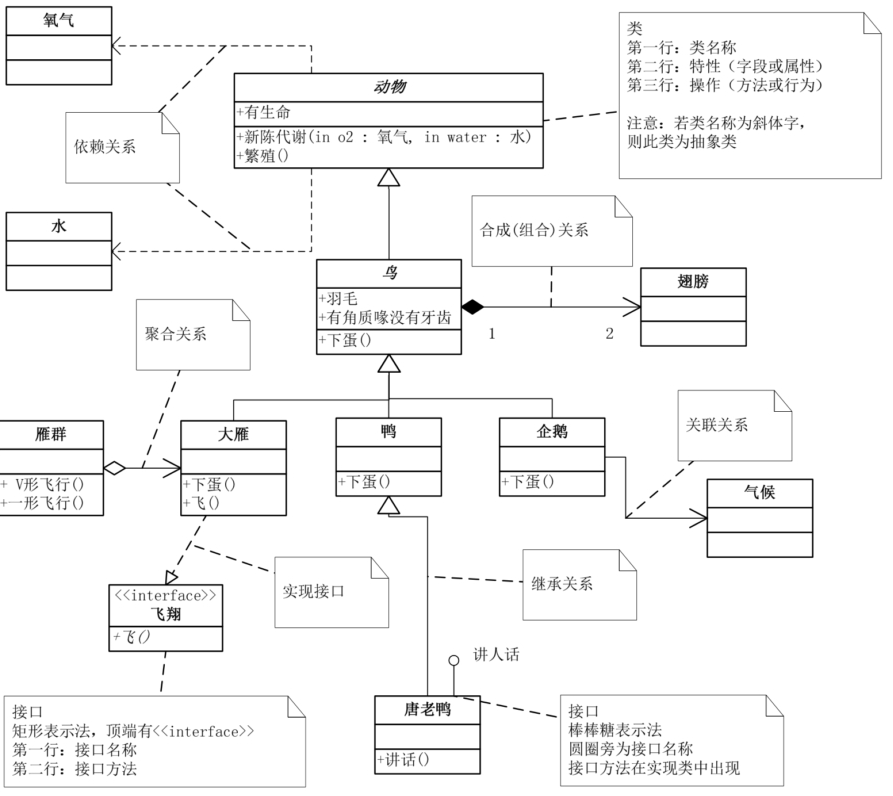
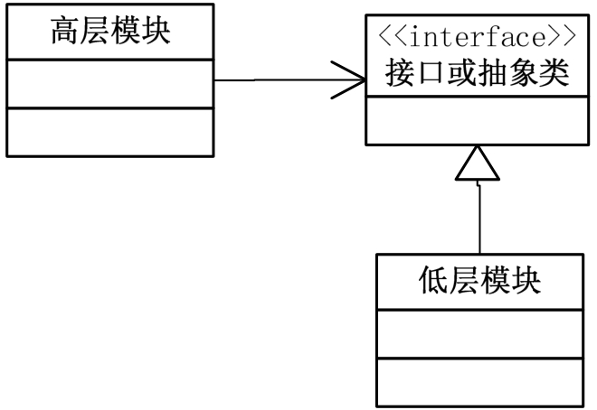
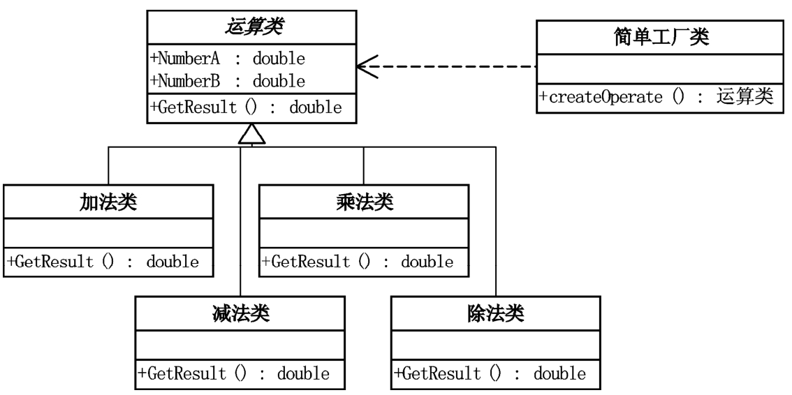
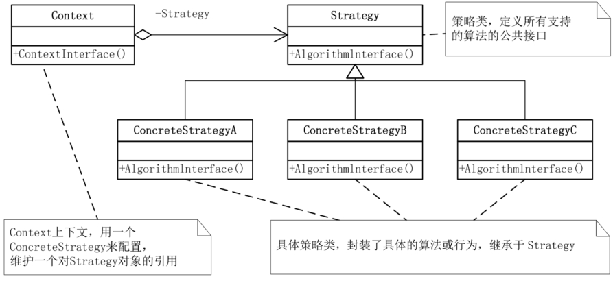
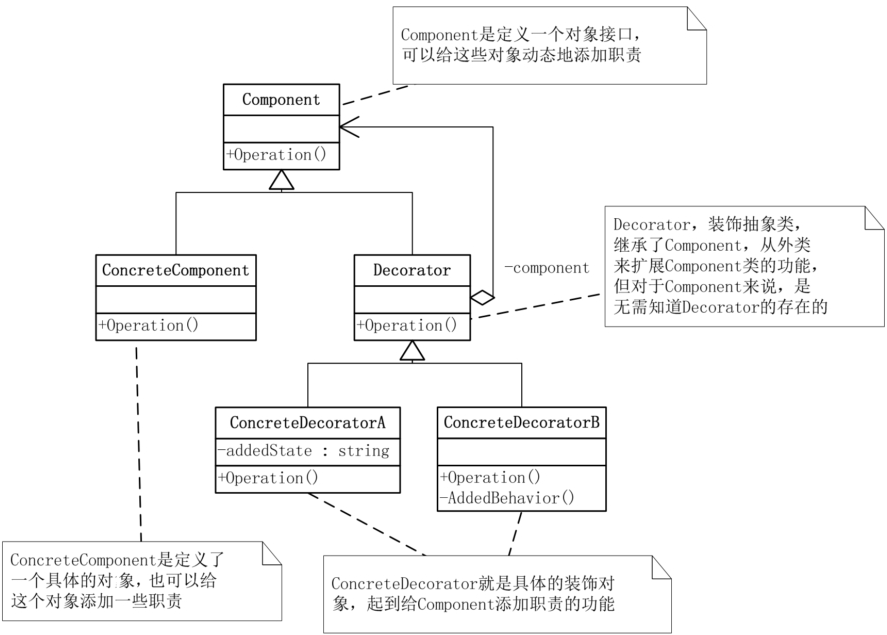
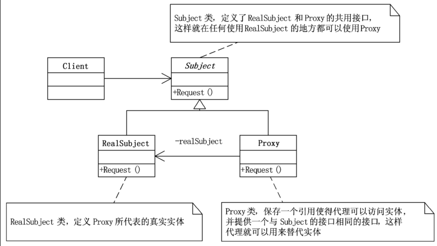
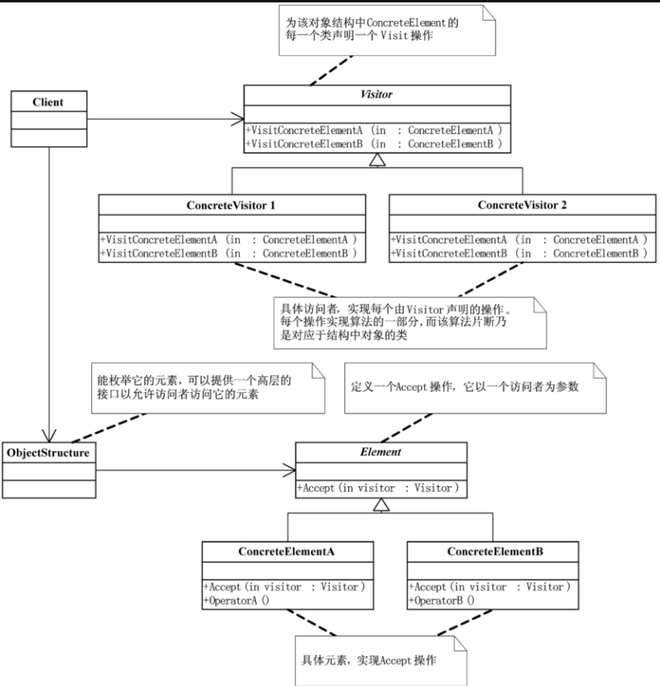

# Design Pattern (大话设计模式)

## UML

## SOLID principles

### Single Responsibility Principle

单一职责原则（SRP），就一个类而言，应该仅有一个引起它变化的原因。

如果一个类承担的职责过多，就等于把这些职责耦合在一起，一个职责的变化可能会削弱或者抑制这个类完成其他职责的能力。这种耦合会导致脆弱的设计，当变化发生时，设计会遭受到意想不到的破坏 ​。

软件设计真正要做的许多内容，就是发现职责并把那些职责相互分离 ​。其实要去判断是否应该分离出类来，也不难，那就是如果你能够想到多于一个的动机去改变一个类，那么这个类就具有多于一个的职责

### Open/Closed Principle

面对需求，对程序的改动是通过增加新代码进行的，而不是更改现有的代码 ​。这就是‘开放-封闭原则’的精神所在。

大鸟：​“开放-封闭原则是面向对象设计的核心所在。遵循这个原则可以带来面向对象技术所声称的巨大好处，也就是可维护、可扩展、可复用、灵活性好。开发人员应该仅对程序中呈现出频繁变化的那些部分做出抽象，然而，对于应用程序中的每个部分都刻意地进行抽象同样不是一个好主意。拒绝不成熟的抽象和抽象本身一样重要。

### Dependency Inversion Principle

抽象不应该依赖细节，细节应该依赖于抽象，这话绕口，说白了，就是要针对接口编程，不要对实现编程，无论主板、CPU、内存、硬盘都是在针对接口设计的，如果针对实现来设计，内存就要对应到具体的某个品牌的主板，那就会出现换内存需要把主板也换了的尴尬

**里氏代换原则** 是 Barbara Liskov 女士在 1988 年发表的 ​，具体的数学定义比较复杂，你可以查相关资料，它的白话翻译就是一个软件实体如果使用的是一个父类的话，那么一定适用于其子类，而且它察觉不出父类对象和子类对象的区别。也就是说，在软件里面，把父类都替换成它的子类，程序的行为没有变化，简单地说，子类型必须能够替换掉它们的父类型。

依赖倒转其实可以说是面向对象设计的标志，用哪种语言来编写程序不重要，如果编写时考虑的都是如何针对抽象编程而不是针对细节编程，即程序中所有的依赖关系都是终止于抽象类或者接口，那就是面向对象的设计，反之那就是过程化的设计了。

## Design Patterns

### Simple Factory Pattern

简单工厂模式 (Simple factory)，通过一个 Factory 类，去实例化所需的对象。

优点：松耦合，每个 operation 和其他的都不相干。增减 operation 只需要改动自己和 factory 里的条件。

### Strategy Pattern

策略模式定义了算法家族，分别封装起来，让它们之间可以互相替换，此模式让算法的变化，不会影响到使用算法的客户。

当不同的行为堆砌在一个类中时，就很难避免使用条件语句来选择合适的行为。将这些行为封装在一个个独立的 Strategy 类中，可以在使用这些行为的类中消除条件语句 ​。就商场收银系统的例子而言，在客户端的代码中就消除条件语句，避免了大量的判断（判断交给了 context）。

策略模式就是用来封装算法的，但在实践中，我们发现可以用它来封装几乎任何类型的规则，只要在分析过程中听到需要在不同时间应用不同的业务规则，就可以考虑使用策略模式处理这种变化的可能性。

在基本的策略模式中，选择所用具体实现的职责由客户端对象承担，并转给策略模式的 Context 对象 ​。这本身并没有解除客户端需要选择判断的压力，而策略模式与简单工厂模式结合后，选择具体实现的职责也可以由 Context 来承担，这就最大化地减轻了客户端的职责

### Decorator Pattern

装饰模式是为已有功能动态地添加更多功能的一种方式

The Decorator Pattern allows you to add new functionality to an object dynamically, without changing its structure. It does this by wrapping the original object with decorator objects that add new behaviors.

The decorator pattern lets you "dress up" an object step by step, each time adding new behavior, just like putting on clothes layer by layer.

装饰模式却提供了一个非常好的解决方案，它把每个要装饰的功能放在单独的类中，并让这个类包装它所要装饰的对象，因此，当需要执行特殊行为时，客户代码就可以在运行时根据需要有选择地、按顺序地使用装饰功能包装对象了。

把类中的装饰功能从类中搬移去除，这样可以简化原有的类。这样做更大的好处就是有效地把类的核心职责和装饰功能区分开了，而且可以去除相关类中重复的装饰逻辑。

### Proxy Pattern

代理模式都用在一些什么场合:

第一，远程代理，也就是为一个对象在不同的地址空间提供局部代表。这样可以隐藏一个对象存在于不同地址空间的事实

第二种应用是虚拟代理，是根据需要创建开销很大的对象。通过它来存放实例化需要很长时间的真实对象

第三种应用是安全代理，用来控制真实对象访问时的权限

第四种是智能指引，是指当调用真实的对象时，代理处理另外一些事

### Factory Method Pattern

### Visitor Pattern

访问者模式（Visitor），表示一个作用于某对象结构中的各元素的操作。它使你可以在不改变各元素的类的前提下定义作用于这些元素的新操作

优点: 增加新的操作 (Visitor) 很容易，只需要增加一个 Visitor 的子类。
缺点：增加新的数据结构 (Element) 变得困难。
总结：只有 element 不变的时候，visitor 才适用。所以适用范围并不广。
