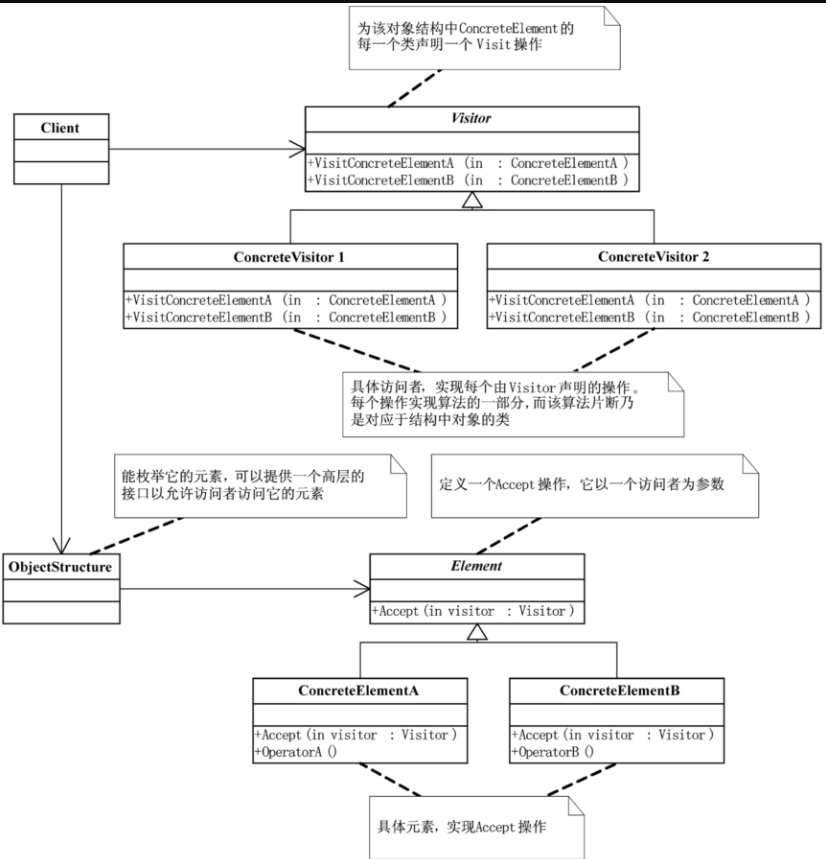

# Design Patter (大话设计模式)

## Simple Factory

## Visitor

访问者模式（Visitor），表示一个作用于某对象结构中的各元素的操作。它使你可以在不改变各元素的类的前提下定义作用于这些元素的新操作

优点: 增加新的操作 (Visitor) 很容易，只需要增加一个 Visitor 的子类。
缺点：增加新的数据结构 (Element) 变得困难。
总结：只有 element 不变的时候，visitor 才适用。所以适用范围并不广。
